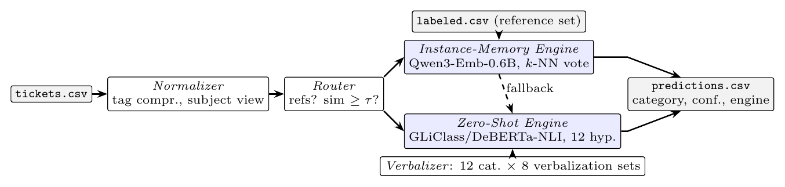
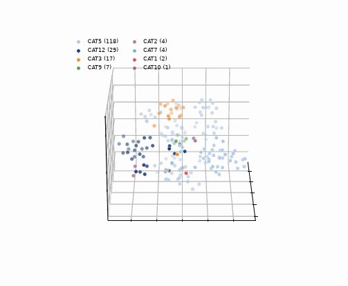

# ZeroLINC: Training-Free Local Classification of Security Incident Reports

ZeroLINC is an open-source command-line tool that assigns SOC/CSIRT incident tickets to the 12 categories derived from NIST SP 800-61r3, locally, with no model training and no external API. No weights are ever updated: the `train` command only persists an embedding index. It carries two engines in one tool: an **instance-memory engine** that votes over previously labeled tickets, weighted by similarity, and reaches **90.8%** mean test accuracy from 89 labeled references, and a **zero-shot engine** for deployments with no labeled data at all, reaching up to **70.9%**. Classifying the whole evaluation corpus takes seconds and under 3 Wh on one GPU. This repository is the artifact of the paper *"ZeroLINC: Training-Free Local Classification of Security Incident Reports"* (SBSeg 2026, Salão de Ferramentas, Código Aberto).

> **Paper:** *ZeroLINC: Training-Free Local Classification of Security Incident Reports*, SBSeg 2026, Salão de Ferramentas. Artifact evaluation follows the official [submission](https://doc-artefatos.github.io/sbseg2026/subinstrucoes.html) and [review](https://doc-artefatos.github.io/sbseg2026/revinstrucoes.html) instructions.

> **For the artifact evaluation, this README is the only file you need to read.** The other Markdown files are complementary: [`docs/architecture.md`](docs/architecture.md) holds the data-flow and module diagrams, and [`examples/README.md`](examples/README.md) describes the bundled sample.

**Demonstration video** (installation and both engines): https://youtu.be/hbo6mkqxbRc

<p align="center"></p>

<p align="center"></p>
<p align="center"><em>Why the instance-memory engine works: recurring alert templates form tight per-category clusters in the embedding space. <a href="docs/img/latent_space_3d.html">Interactive version</a> (download and open; no ticket text embedded).</em></p>

## README structure

| Section | Description |
|---|---|
| [Considered seals](#considered-seals) | The four seals and why each one holds |
| [Basic information](#basic-information) | OS, runtime, hardware and measured times |
| [Dependencies](#dependencies) | Pinned packages, and where the models and data come from |
| [Security concerns](#security-concerns) | What runs where, network use, incident data |
| [Installation](#installation) | Clone and one environment |
| [Minimal test](#minimal-test) | One command, one real classification |
| [Experiments](#experiments) | Claims #1 to #3, one command each |
| [Cleaning up](#cleaning-up) | One command removes what a run created |
| [How to cite](#how-to-cite) | Paper reference, BibTeX and `CITATION.cff` |
| [LICENSE](#license) | AGPL-3.0-or-later |

The repository is organized as follows:

```
src/zerolinc/            the tool, one module per architecture component
  normalizer.py          loads and cleans tickets, assigns surrogate identifiers
  verbalizer.py          the 12 NIST-derived categories and their descriptions
  zeroshot_engine.py     classification with no labeled data
  memory_engine.py       similarity-weighted vote over labeled tickets
  router.py              picks the engine per ticket and writes predictions
  cli.py                 the command-line entry points
examples/                the reference study's five public sample tickets
docs/architecture.md     data-flow, module and sequence diagrams
tests/                   offline unit tests (7, no network, no model)
minimal_test.sh          the minimal test
run_claim{1,2,3}.sh      one script per paper claim
cleanup.sh               removes everything a run created
```

The measurement study behind the tool lives in the companion repository [zerolinc-benchmark](https://github.com/CristhianKapelinski/zerolinc-benchmark): the full grid of 292 evaluation runs, the committed run of record, and the selection protocol. The claim scripts clone it automatically at a pinned commit; you never need to visit it.

## Considered seals

The seals considered are: **Available (SeloD)**, **Functional (SeloF)**, **Sustainable (SeloS)** and **Reproducible (SeloR)**.

- **Available (SeloD):** this repository is public under AGPL-3.0-or-later, with the tool, the sample tickets, the diagrams and the three claim scripts. The evaluation run of record lives in the companion repository, also public, which the claims fetch at a pinned commit. Nothing comes from a private location.
- **Functional (SeloF):** [`./minimal_test.sh`](minimal_test.sh) runs the offline unit suite and then classifies the bundled sample tickets with the real zero-shot engine, printing the predictions it produced. It exercises the pipeline a user runs, not `--help`.
- **Sustainable (SeloS):** one module per architecture component under [`src/zerolinc/`](src/zerolinc), each with a single responsibility and a docstring stating it, so an engine or a verbalization can be replaced without touching the rest. Every dependency is pinned in [`uv.lock`](uv.lock); the categories, the prompts and the protocol are data, not code, so adapting the tool to another taxonomy is an edit to [`verbalizer.py`](src/zerolinc/verbalizer.py) rather than a rewrite. The identifier handling is part of this: [`normalizer.py`](src/zerolinc/normalizer.py) replaces each ticket's tracker identifier with a surrogate at load time, so a result file is publishable by construction and not by remembering to sanitize it.
- **Reproducible (SeloR):** each claim recomputes and prints the paper's value beside the one it just produced, with `OK`/`FAIL` per line and a non-zero exit on any mismatch. The incident corpus belongs to the reference study and is not redistributable, so Claim #1 verifies against the committed per-split run of record when the corpus is absent and re-measures live when it is present; the result block states which of the two it read. Claim #2 is deterministic and needs neither corpus nor GPU.

## Basic information

| Component | Requirement |
|---|---|
| OS | Linux x86-64 |
| Runtime | Python ≥ 3.11, managed by [`uv`](https://docs.astral.sh/uv/) |
| RAM | 4 GB for the claims; 16 GB recommended for the live paths |
| Disk | ~15 GB: the environment plus the model checkpoints downloaded on first use |
| GPU | optional. Every claim completes without one; a CUDA GPU with ≥ 4 GB only makes the live paths faster |

**Measured times.** The paper's campaign ran on an AMD Ryzen 5 8600G (6 cores), 30 GB RAM, NVIDIA RTX 5060 Ti (16 GB), Linux kernel 6.17, Python 3.13, PyTorch 2.11 (cu128), Transformers 5.12. The times below were measured on an AMD Ryzen 7 9700X (16 threads, 59 GB RAM, RTX 5080), with the models already downloaded.

| Step | Command | Measured |
|---|---|---|
| Install | `uv sync --extra dev` | ~3 min cold, seconds warm |
| Minimal test | `./minimal_test.sh` | MT_TIME (first run also downloads ~0.8 GB) |
| **Claim #1** | `./run_claim1.sh` | C1_TIME from the run of record; ~3 min re-measured on a GPU |
| **Claim #2** | `./run_claim2.sh` | C2_TIME |
| **Claim #3** | `./run_claim3.sh` | C3_TIME |

## Dependencies

- **Python packages** are pinned to exact versions in the committed [`uv.lock`](uv.lock): PyTorch 2.11 (cu128), Transformers 5.12, Sentence-Transformers 5.6, GLiClass 0.1.18 and pandas. `uv sync` installs exactly those; no `pip` step is involved.
- **System tools:** `git`, `curl` and `uv`. The installation section below fetches `uv` if it is missing.
- **Model checkpoints** download from the HuggingFace Hub on first use (~2 GB for the default engines). Set `HF_HUB_CACHE` to choose where they land; the default is the shared cache in your home directory.
- **The evaluation run of record** comes from the companion repository, cloned by the claim scripts at a pinned commit so a later change there cannot alter what you reproduce.
- **The incident corpus is not redistributed.** It belongs to the reference study (Severo et al., SBSeg 2025, DOI [10.5753/sbseg_estendido.2025.12510](https://doi.org/10.5753/sbseg_estendido.2025.12510)), which publishes only a five-ticket sample. No claim requires it: with the corpus in place Claim #1 re-measures, and without it the same numbers are verified against the committed per-split records.

## Security concerns

- Everything runs locally. No telemetry, no external API call, no credential, no port opened. The only network use is downloading the model checkpoints on first run and cloning the companion repository.
- Incident data never leaves the machine, and never enters this repository. The tool replaces each ticket's tracker identifier with a surrogate when it loads the file, so the result files it writes carry categories and surrogates only, with no ticket text and no identifier that resolves to a real record.
- The bundled sample tickets are the anonymized five that the reference study publishes; sensitive spans are already replaced by placeholder tags.

## Installation

Keep the clone and the `cd` on separate lines: chained with `&&`, a clone that fails because the directory already exists silently skips the `cd`, and every command after it runs in the parent directory.

```bash
git clone https://github.com/CristhianKapelinski/zerolinc
cd zerolinc
curl -LsSf https://astral.sh/uv/install.sh | sh    # skip if uv is already installed
uv sync --extra dev
```

## Minimal test

One command. It runs the offline unit suite and then classifies the bundled sample tickets with the real zero-shot engine:

```bash
./minimal_test.sh
```

- **Expected time:** MT_TIME measured. The first run also downloads the ~0.8 GB checkpoint.
- **Expected resources:** ~4 GB RAM, ~1 GB disk beyond the environment. No GPU required.
- **Expected result:** the suite passes, five tickets are classified, and the run ends in `MINIMAL TEST: PASSED`:

```text
MT_OUTPUT
```

## Experiments

> ### READ THIS BEFORE RUNNING ANY EXPERIMENT
>
> **Three claims, one command each, none of them requiring a GPU or the incident corpus.**
>
> - Every claim prints the paper's value beside the one it produced and exits non-zero on a mismatch.
> - Each block names the source of its numbers: measured on your machine, or read from the committed run of record. Claim #1 measures live only if you obtained the corpus, which is not ours to redistribute.
> - A GPU changes nothing you type. It only makes the live paths faster.

### Claim #1: the instance-memory engine reaches 90.8% mean test accuracy from 89 labeled references, with no gradient training

**Paper reference:** the headline result, Table with the per-protocol accuracies, and the mean of 90.8% (range 89.2–92.5%) with McNemar p < 0.001 against the majority-class baseline in every split.

**What this claim asserts, and where it is weakest.** The engine votes over tickets an operator has already classified, so it needs those labels: with none, this claim does not apply and the zero-shot engine of Claim #2 is the fallback, at 20 points less accuracy. The corpus is the reference study's and cannot be redistributed, so unless you obtained it this claim verifies the committed per-split records rather than re-measuring, and says so in its own output.

```bash
./run_claim1.sh
```

- **Flags:** none. Place `data/185_incidentes_anon.csv` in the fetched companion repository to switch to the live path.
- **Expected time:** C1_TIME from the run of record; about 3 minutes re-measured on a GPU, 15 on CPU.
- **Expected resources:** ~4 GB RAM. GPU optional, network only for the first fetch.
- **Expected result:**

```text
C1_OUTPUT
```

### Claim #2: the zero-shot engines reach up to 70.9%, and 68.8% under the selection protocol

**Paper reference:** the 292-run grid and the protocol means.

**What this claim asserts.** Recomputes every metric of the grid from the committed per-ticket predictions and re-runs the 5-seed selection protocol. Reporting the grid maximum alone would flatter the method, which is why the protocol mean is reported beside it and why the majority-class floor is printed for comparison.

```bash
./run_claim2.sh
```

- **Flags:** none.
- **Expected time:** C2_TIME measured. Deterministic.
- **Expected resources:** ~2 GB RAM, ~1 GB disk. No GPU, no corpus.
- **Expected result:**

```text
C2_OUTPUT
```

### Claim #3: the default zero-shot engine classifies the corpus in seconds and under 3 Wh

**Paper reference:** the cost section.

**What this claim asserts.** That running the tool locally is cheap enough to be worth doing, on the same 182-ticket corpus. Wall clock and energy are hardware-dependent, so what is gated is the bound: under 60 seconds and under 3 Wh.

```bash
./run_claim3.sh
```

- **Flags:** `SKIP_LIVE=1 ./run_claim3.sh` forces the committed-record path even when a GPU is present.
- **Expected time:** C3_TIME measured.
- **Expected resources:** ~4 GB RAM, ~1 GB VRAM on the live path.
- **Expected result:**

```text
C3_OUTPUT
```

## Cleaning up

One command removes everything a run created, the environment, the fetched companion repository and the sample output. It never touches anything tracked by git.

```bash
./cleanup.sh
```

Pass `--dry-run` to list what would go without removing it. The model checkpoints live in the shared HuggingFace cache, which usually holds models this artifact never asked for, so they are kept and named rather than deleted; point `HF_HUB_CACHE` inside the clone before running if you want them removed with everything else.

## How to cite

Cite the paper, not the repository:

> Kapelinski, C., Machado, B. and Kreutz, D. (2026). ZeroLINC: Training-Free Local Classification of Security Incident Reports. In *Anais do XXVI Simpósio Brasileiro de Segurança da Informação e de Sistemas Computacionais (SBSeg 2026)*, Salão de Ferramentas. Sociedade Brasileira de Computação (SBC).

```bibtex
@inproceedings{kapelinski2026zerolinc,
  author    = {Kapelinski, Cristhian and Machado, Beatriz and Kreutz, Diego},
  title     = {{ZeroLINC}: Training-Free Local Classification of Security Incident Reports},
  booktitle = {Anais do XXVI Simp\'osio Brasileiro de Seguran\c{c}a da Informa\c{c}\~ao e de
               Sistemas Computacionais (SBSeg 2026), Sal\~ao de Ferramentas},
  year      = {2026},
  publisher = {Sociedade Brasileira de Computa\c{c}\~ao (SBC)},
}
```

[`CITATION.cff`](CITATION.cff) carries the same reference in machine-readable form, which is what GitHub's "Cite this repository" button and Zenodo read.

## LICENSE

[GNU AGPL-3.0](LICENSE).
