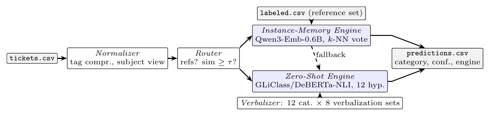
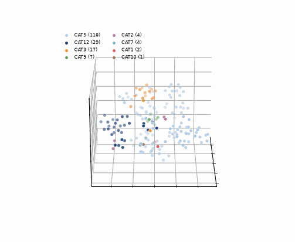

# ZeroLINC: Training-Free Local Classification of Security Incident Reports

ZeroLINC is an open-source command-line tool that assigns SOC/CSIRT incident tickets to the 12 categories derived from NIST SP 800-61r3, locally, with no model training and no external API. No weights are ever updated: the `train` command only persists an embedding index. It carries two engines in one tool: an **instance-memory engine** that votes over previously labeled tickets, weighted by similarity, and reaches **90.8%** mean test accuracy from 89 labeled references, and a **zero-shot engine** for deployments with no labeled data at all, reaching up to **70.9%**. Classifying the whole evaluation corpus takes seconds and under 3 Wh on one GPU. This repository is the artifact of the paper *"ZeroLINC: Training-Free Local Classification of Security Incident Reports"* (SBSeg 2026, Salão de Ferramentas, Código Aberto).

> **Paper:** *ZeroLINC: Training-Free Local Classification of Security Incident Reports*, SBSeg 2026, Salão de Ferramentas. Artifact evaluation follows the official [submission](https://doc-artefatos.github.io/sbseg2026/subinstrucoes.html) and [review](https://doc-artefatos.github.io/sbseg2026/revinstrucoes.html) instructions.

> **For the artifact evaluation, this README is the only file you need to read.** The other Markdown files are complementary: [`docs/architecture.md`](docs/architecture.md) holds the data-flow and module diagrams, and [`examples/README.md`](examples/README.md) describes the bundled sample.

**Demonstration video** (installation and both engines): https://youtu.be/hbo6mkqxbRc

<p align="center"></p>

<p align="center"></p>
<p align="center"><em>Why the instance-memory engine works: recurring alert templates form tight per-category clusters in the embedding space. <a href="docs/img/latent_space_3d.html">Interactive version</a> (download and open; no ticket text embedded).</em></p>

## README structure

| Section | Description |
|---|---|
| [Considered seals](#considered-seals) | The four seals and why each one holds |
| [Basic information](#basic-information) | OS, runtime, compilers, the two machines and measured times |
| [Dependencies](#dependencies) | Pinned packages, and where the models and data come from |
| [Security concerns](#security-concerns) | What runs where, network use, incident data |
| [Installation](#installation) | Clone and one environment |
| [Minimal test](#minimal-test) | One command, one real classification |
| [Using it on your own tickets](#using-it-on-your-own-tickets) | Input format, the engines, output columns |
| [Experiments](#experiments) | Claims #1 to #3, one command each |
| [Cleaning up](#cleaning-up) | One command removes what a run created |
| [How to cite](#how-to-cite) | Paper reference, BibTeX and `CITATION.cff` |
| [LICENSE](#license) | AGPL-3.0-or-later |

The repository is organized as follows:

```
src/zerolinc/            the tool, one module per architecture component
  normalizer.py          loads and cleans tickets, assigns surrogate identifiers
  verbalizer.py          the 12 NIST-derived categories and their descriptions
  zeroshot_engine.py     classification with no labeled data
  memory_engine.py       similarity-weighted vote over labeled tickets
  router.py              picks the engine per ticket and writes predictions
  cli.py                 the command-line entry points
examples/                the reference study's five public sample tickets
docs/architecture.md     data-flow, module and sequence diagrams
tests/                   offline unit tests (7, no network, no model)
minimal_test.sh          the minimal test
run_claim{1,2,3}.sh      one script per paper claim
cleanup.sh               removes everything a run created
```

The measurement study behind the tool lives in the companion repository [zerolinc-benchmark](https://github.com/CristhianKapelinski/zerolinc-benchmark): the full grid of 292 evaluation runs, the committed run of record, and the selection protocol. The claim scripts clone it automatically at a pinned commit; you never need to visit it.

## Considered seals

The seals considered are: **Available (SeloD)**, **Functional (SeloF)**, **Sustainable (SeloS)** and **Reproducible (SeloR)**.

- **Available (SeloD):** this repository is public under AGPL-3.0-or-later, with the tool, the sample tickets, the diagrams and the three claim scripts. The evaluation run of record lives in the companion repository, also public, which the claims fetch at a pinned commit. Nothing comes from a private location.
- **Functional (SeloF):** [`./minimal_test.sh`](minimal_test.sh) runs the offline unit suite and then classifies the bundled sample tickets with the real zero-shot engine, printing the predictions it produced. It exercises the pipeline a user runs, not `--help`.
- **Sustainable (SeloS):** one module per architecture component under [`src/zerolinc/`](src/zerolinc), each with a single responsibility and a docstring stating it, so an engine or a verbalization can be replaced without touching the rest. Every dependency is pinned in [`uv.lock`](uv.lock); the categories, the prompts and the protocol are data, not code, so adapting the tool to another taxonomy is an edit to [`verbalizer.py`](src/zerolinc/verbalizer.py) rather than a rewrite. The identifier handling is part of this: [`normalizer.py`](src/zerolinc/normalizer.py) replaces each ticket's tracker identifier with a surrogate at load time, so a result file is publishable by construction and not by remembering to sanitize it.
- **Reproducible (SeloR):** each claim recomputes and prints the paper's value beside the one it just produced, with `OK`/`FAIL` per line and a non-zero exit on any mismatch. The incident corpus belongs to the reference study and is not redistributable, so Claim #1 verifies against the committed per-split run of record when the corpus is absent and re-measures live when it is present; the result block states which of the two it read. Claim #2 is deterministic and needs neither corpus nor GPU.

## Basic information

### What you need

| Component | Requirement |
|---|---|
| OS | Linux x86-64, any current distribution: the artifact installs no system package beyond `git` and `curl`. The only distribution pinned anywhere in the project is Ubuntu 24.04 LTS, in the companion repository's `Dockerfile` (`FROM nvidia/cuda:12.8.0-runtime-ubuntu24.04`), which is the closest reproducible match to the campaign environment described below |
| Runtime | Python ≥ 3.11, managed by [`uv`](https://docs.astral.sh/uv/): it uses a suitable interpreter if it finds one and downloads one otherwise, so no system Python is required |
| `uv` | ≥ 0.8.4. The committed [`uv.lock`](uv.lock) is lockfile `version = 1`, `revision = 3`, the format uv writes from 0.8.4 onwards. An older uv still reads the file — revision bumps are backwards compatible — but rewrites it on the first `uv lock` |
| Compilers | none, and none is invoked. All 73 third-party packages in `uv.lock` resolve to prebuilt wheels, PyTorch and the CUDA runtime (`nvidia-cuda-runtime-cu12` 12.8.90) included; the only package built locally is `zerolinc` itself, pure Python through `hatchling`. No `gcc`, no `nvcc`, no CUDA toolkit on the host |
| RAM | 4 GB for the claims; 16 GB recommended for the live paths |
| Disk | ~15 GB: the environment plus the model checkpoints downloaded on first use |
| GPU | optional. Every claim completes without one; a CUDA GPU with ≥ 4 GB only makes the live paths faster. A card older than the pinned PyTorch build supports is detected and skipped in favour of the CPU, with the reason printed; `ZEROLINC_DEVICE=cpu` or `=cuda` overrides the choice |

### The two machines behind the numbers in this README

Two different hosts appear below, and which one a number came from decides what it means for you.

| | **Machine A** — the experimental campaign | **Machine B** — the timings in this README |
|---|---|---|
| What it produced | every accuracy, energy and VRAM figure in the paper and in Claims #1 to #3. They are read back from the committed run of record, which was measured here; running a claim elsewhere re-verifies those records, it does not re-measure them | only the wall-clock durations in the table below: how long each command takes, nothing else |
| CPU | AMD Ryzen 5 8600G, 6 cores | AMD Ryzen 7 9700X, 16 threads |
| RAM | 30 GB | 59 GB |
| GPU | NVIDIA GeForce RTX 5060 Ti, 15.5 GB visible to CUDA | NVIDIA GeForce RTX 5080, driver 595.80 |
| Kernel | Linux 6.17.0-35-generic, x86-64, glibc 2.39 | Linux 7.0.0-29-generic, x86-64, glibc 2.43 |
| Distribution | Ubuntu 24.04 LTS | Ubuntu 26.04 LTS |
| Python | 3.13 | 3.13 |
| Stack | PyTorch 2.11.0+cu128, Transformers 5.12.1, Sentence-Transformers 5.6.0, GLiClass 0.1.18, as pinned by the companion repository's `uv.lock` | the same versions, from this repository's `uv.lock` |

**Which of these are records and which are the authors' word.** Every result file in the companion repository carries a `machine` block written by Python's `platform` module: 292 of the 297 records have one, and 291 of them report Machine A as `Linux-6.17.0-35-generic-x86_64-with-glibc2.39`, and the remaining one, the default-engine cost record Claim #3 reads, was re-run later on the same host under `6.17.0-40-generic`. All 292 report the GPU as `NVIDIA GeForce RTX 5060 Ti`, 15.5 GB. That block is the source of the kernel, architecture, glibc and GPU rows above. It carries no distribution name and `platform.processor()` returns only `x86_64` on Linux, so the distribution, the CPU model, the RAM and the Python version of Machine A are as reported by the authors rather than read back from a record. The glibc 2.39 in those records is the version Ubuntu 24.04 ships, which is consistent with the distribution stated above. The `uv` version used was never logged either; all the artifact fixes is the lower bound in the table above, derived from the lockfile revision. Nothing any claim verifies depends on these: the claims read committed records that contain the per-ticket predictions themselves, and Claim #2 is deterministic.

### Measured times

Machine B, with the models already downloaded. The last column is a third host, with an empty `uv` cache and no checkpoint on disk, which is the situation of a first-time reviewer; nothing beyond these durations was recorded about it.

| Step | Command | Machine B, warm caches | A cold host, nothing cached |
|---|---|---|---|
| Install | `uv sync --extra dev` | 0.9 s | 1 min 17 s (downloads ~7 GB of wheels, mostly the CUDA build of PyTorch) |
| Minimal test | `./minimal_test.sh` | 32 s, 1.6 GB peak RAM | 34 s, the 606 MB model download included |
| **Claim #1** | `./run_claim1.sh` | 1.9 s | plus a one-time clone and build of the companion repository |
| **Claim #2** | `./run_claim2.sh` | 22 s | idem |
| **Claim #3** | `./run_claim3.sh` | 0.04 s | idem |

The last column is the one to plan around: on a machine with an empty `uv` cache and no
model downloaded, the whole path above is dominated by those two downloads, and the first
claim you run also fetches and builds the companion repository (~7 GB more). Everything
after that is seconds. `./cleanup.sh` gives all of it back.

## Dependencies

- **Python packages** are pinned to exact versions in the committed [`uv.lock`](uv.lock): PyTorch 2.11.0+cu128, Transformers 5.12.1, Sentence-Transformers 5.6.0, GLiClass 0.1.18, pandas 3.0.3 and numpy 2.5.0, on Python ≥ 3.11. `uv sync` installs exactly those, all as prebuilt wheels; no `pip` step and no compiler are involved.
- **System tools:** `git`, `curl` and `uv` ≥ 0.8.4 (see [Basic information](#basic-information)); no Docker. The installation section below fetches `uv` if it is missing, and every script checks all three before doing any work, printing the install command for the package manager it finds.

  ```bash
  sudo apt-get update && sudo apt-get install -y git curl   # Debian, Ubuntu
  sudo dnf install -y git curl                              # Fedora, RHEL
  sudo pacman -Sy --needed git curl                         # Arch
  sudo zypper install -y git curl                           # openSUSE
  curl -LsSf https://astral.sh/uv/install.sh | sh           # uv
  export PATH="$HOME/.local/bin:$PATH"                      # the installer cannot do this for the running shell
  ```

  `git` is not needed only to clone: the claim scripts use it to fetch the companion repository at its pinned commit.
- **Model checkpoints** download from the HuggingFace Hub on first use (~2 GB for the default engines). Set `HF_HUB_CACHE` to choose where they land; the default is the shared cache in your home directory.
- **The evaluation run of record** comes from the companion repository, cloned by the claim scripts at a pinned commit so a later change there cannot alter what you reproduce.
- **The incident corpus is not redistributed.** It belongs to the reference study (Severo et al., SBSeg 2025, DOI [10.5753/sbseg_estendido.2025.12510](https://doi.org/10.5753/sbseg_estendido.2025.12510)), which publishes only a five-ticket sample. No claim requires it: with the corpus in place Claim #1 re-measures, and without it the same numbers are verified against the committed per-split records.

## Security concerns

- Everything runs locally. No telemetry, no external API call, no credential, no port opened. The only network use is downloading the model checkpoints on first run and cloning the companion repository.
- Incident data never leaves the machine, and never enters this repository. The tool replaces each ticket's tracker identifier with a surrogate when it loads the file, so the result files it writes carry categories and surrogates only, with no ticket text and no identifier that resolves to a real record.
- The bundled sample tickets are the anonymized five that the reference study publishes; sensitive spans are already replaced by placeholder tags.

## Installation

Keep the clone and the `cd` on separate lines: chained with `&&`, a clone that fails because the directory already exists silently skips the `cd`, and every command after it runs in the parent directory.

```bash
git clone https://github.com/CristhianKapelinski/zerolinc
cd zerolinc
curl -LsSf https://astral.sh/uv/install.sh | sh    # skip if uv is already installed
export PATH="$HOME/.local/bin:$PATH"   # where the installer puts uv; the current shell needs telling
uv sync --extra dev
```

## Minimal test

One command. It runs the offline unit suite and then classifies the bundled sample tickets with the real zero-shot engine:

```bash
./minimal_test.sh
```

- **Expected time:** 32 s on Machine B with the checkpoint already cached. The first run also downloads it (~0.8 GB).
- **Expected resources:** 1.6 GB peak RAM on Machine B, ~1 GB disk beyond the environment. No GPU required.
- **Expected result:** the suite passes, five tickets are classified, and the run ends in `MINIMAL TEST: PASSED`:

```text
== [1/2] unit suite (offline, no model) ==
7 passed, 2 warnings in 6.85s

== [2/2] classifying the bundled sample with the zero-shot engine ==
5 tickets classified -> predictions.csv
engines: {'zeroshot': 5}
categories: {'CAT5': 5}

MINIMAL TEST: PASSED
```

## Using it on your own tickets

Nothing in the tool is tied to the evaluation corpus: `classify` reads a CSV, and every column
name is a flag. This section is the whole contract, and the commands below run as written.

### The input file

One row per ticket. Only the text column has to exist:

| What | Flag | Default column name | Required |
|---|---|---|---|
| ticket text | `--text-column` | `conteudo` | yes |
| ticket identifier | `--id-column` | `incidente_id`, else `id`, else the row number | no |
| category label | `--label-column` | `categoria` | only in a labeled reference file |

Any other column is ignored, and the input file is never written to. `--text-column` and
`--id-column` apply to the file being classified *and* to a `--memory` reference file, so give
the two files the same column names. Two things happen to the text as it loads: anonymization
tags of the form `[EMAIL_ADDRESS_f6f7086365]` collapse to `<EMAIL>` (those hashes carry no
signal and eat the encoder's 512-token window), and runs of spaces and tabs collapse to one.
Nothing is deleted. Ticket text in any language works: the corpus behind the paper is in
Portuguese, while the category hypotheses the engines score against are English by default.

In a labeled file, every label must be one of the twelve NIST SP 800-61r3-derived codes —
anything else is rejected at load time, naming the offending row, as is an empty text cell;
repeated identifiers are dropped, keeping the first occurrence.

| Code | Category | Code | Category |
|---|---|---|---|
| `CAT1` | account compromise | `CAT7` | social engineering |
| `CAT2` | malware | `CAT8` | physical incident |
| `CAT3` | denial of service attack | `CAT9` | unauthorized modification |
| `CAT4` | data leak | `CAT10` | misuse of resources |
| `CAT5` | vulnerability exploitation | `CAT11` | third-party incident |
| `CAT6` | insider abuse | `CAT12` | intrusion attempt |

### Day zero: no labeled data

Point the tool at your file. The column names here are deliberately not the defaults, to show
where the flags go:

```bash
cat > my_tickets.csv <<'CSV'
ticket_id,body
OPS-1001,"Assunto: ransomware no servidor de arquivos do setor financeiro. Durante a madrugada os compartilhamentos foram criptografados e um bilhete de resgate foi deixado em cada diretorio. O antivirus registrou a execucao de um binario desconhecido na estacao de um usuario administrativo."
OPS-1002,"Assunto: varredura de portas originada de 203.0.113.7. O firewall de borda bloqueou tentativas repetidas de conexao na porta TCP 22 em toda a faixa /24 ao longo de duas horas. Nenhum acesso foi concluido com sucesso."
OPS-1003,"Assunto: usuarios recebendo mensagens falsas em nome do diretor financeiro. Dois funcionarios relataram e-mails pedindo transferencia urgente, com dominio parecido com o da instituicao. Nenhum pagamento foi realizado."
CSV

uv run zerolinc classify --input my_tickets.csv \
  --text-column body --id-column ticket_id \
  --engine zeroshot --output my_predictions.csv
```

```text
3 tickets classified -> my_predictions.csv
engines: {'zeroshot': 3}
categories: {'CAT5': 3}
```

```csv
incident_id,category,confidence,engine
OPS-1001,CAT5,0.9872,zeroshot
OPS-1002,CAT5,0.9907,zeroshot
OPS-1003,CAT5,0.88,zeroshot
```

Three tickets, one answer: that is the honest day-zero picture, and the reason the paper reports
the zero-shot engines separately from the headline. On the evaluation corpus this same default
engine answers `CAT5` for 163 of 182 tickets and lands at 67.0% accuracy against a 63.4%
majority-class floor — the record Claim #3 reads. Two ways out, in increasing order of what they
ask of you.

**A stronger zero-shot engine.** `--engine zeroshot-max` swaps the fast GLiClass model for the
DeBERTa-v3-large NLI cross-encoder, the configuration that tops the grid at 70.9% (Claim #2).
Same command, several times slower, and a ~0.9 GB checkpoint on first use. On the three tickets
above it does separate them:

```csv
incident_id,category,confidence,engine
OPS-1001,CAT2,0.7994,zeroshot-max
OPS-1002,CAT11,0.3182,zeroshot-max
OPS-1003,CAT7,0.4097,zeroshot-max
```

Malware and social engineering are right; the blocked port scan should have been `CAT12`, not a
third-party incident.

### With a labeled history: the instance-memory engine

This is the 90.8% path of Claim #1, and it is the reason to keep your closed tickets. Build the
reference index once from tickets you have already categorized:

```bash
cat > my_history.csv <<'CSV'
ticket_id,body,category
H-001,"Assunto: ransomware no servidor de arquivos. Compartilhamentos criptografados e bilhete de resgate deixado em cada diretorio.",CAT2
H-002,"Assunto: trojan detectado na estacao de trabalho. O antivirus removeu um binario malicioso baixado por e-mail.",CAT2
H-003,"Assunto: varredura de portas originada de um IP externo. Firewall bloqueou tentativas repetidas na porta 22.",CAT12
H-004,"Assunto: tentativas de forca bruta contra o SSH, todas bloqueadas pelo firewall de borda.",CAT12
H-005,"Assunto: e-mail falso em nome do diretor financeiro pedindo transferencia urgente.",CAT7
H-006,"Assunto: mensagem fraudulenta pedindo credenciais dos usuarios, dominio parecido com o da instituicao.",CAT7
CSV

uv run zerolinc train --memory my_history.csv \
  --text-column body --id-column ticket_id --label-column category \
  --model-out my_index.npz
```

```text
index built: 6 references (Qwen/Qwen3-Embedding-0.6B) -> my_index.npz
```

`train` updates no weights: it embeds the reference tickets once and stores the vectors, their
labels and their identifiers, so later runs skip re-embedding. Then classify against it:

```bash
uv run zerolinc classify --input my_tickets.csv \
  --text-column body --id-column ticket_id \
  --model my_index.npz --engine auto --output my_predictions.csv
```

```csv
incident_id,category,confidence,engine
OPS-1001,CAT2,0.8365,knn
OPS-1002,CAT12,0.8367,knn
OPS-1003,CAT7,0.8581,knn
```

Six labeled tickets already move all three to the right category; the paper's 90.8% comes from
89 of them. To try the idea without building an index, hand the labeled file to `classify`
directly with `--memory my_history.csv --label-column category`: same predictions, re-embedded
on every run.

Under `--engine auto`, a ticket whose nearest reference is below `--sim-threshold` (0.75) is not
forced onto the memory. It is routed to the zero-shot engine and marked as such in the output, so
an incident type your history has never seen stays visible instead of being silently pulled onto
the closest label. Add one more ticket, a break-in at a server room, which the six-ticket history
above has no analogue for:

```text
OPS-2001,"Assunto: furto de equipamento na sala de servidores. A porta foi arrombada durante a madrugada e dois switches foram levados."
```

```csv
incident_id,category,confidence,engine
OPS-2001,CAT5,0.961,zeroshot-fallback
```

The `engine` column is the useful part here: the label is the zero-shot engine's, with the
accuracy that implies. The fix is to add a labeled example of the new type to the reference
file, not to lower the threshold.

### What comes out

One row per input row, in input order, to `predictions.csv` or wherever `--output` points:

| Column | Meaning |
|---|---|
| `incident_id` | the identifier from `--id-column`, or the row number if the file has none |
| `category` | one of `CAT1`–`CAT12` |
| `confidence` | cosine similarity to the nearest reference for `knn`, a normalized label score for the zero-shot engines. The two are not on the same scale and do not compare across engines |
| `engine` | which engine produced this row: `zeroshot`, `zeroshot-max`, `embed`, `rerank`, `knn` or `zeroshot-fallback` |

No ticket text is written to the output, by construction.

### Engines and knobs

| `--engine` | Needs labels | What it is |
|---|---|---|
| `auto` (default) | no | `knn` when `--memory` or `--model` is given, with the per-ticket fallback above; plain `zeroshot` otherwise |
| `zeroshot` | no | GLiClass `gliclass-modern-base-v3.0`, the fast default, and the engine Claim #3 times |
| `zeroshot-max` | no | DeBERTa-v3-large NLI cross-encoder, the grid's best configuration (Claim #2) |
| `embed` | no | Qwen3-Embedding-0.6B, scoring the ticket against the verbalized categories |
| `rerank` | no | Qwen3-Reranker-0.6B, same idea with a cross-encoder reranker |
| `knn` | yes | similarity-weighted vote of the `--k` nearest labeled tickets (Claim #1); errors out without `--memory` or `--model` |

`--k` (default 3) and `--sim-threshold` (default 0.75) tune the memory engine, `--batch-size`
(default 8) trades memory for speed, and `--embedding-model` (default
`Qwen/Qwen3-Embedding-0.6B`) changes the encoder used by `train` and by `--memory`. Checkpoints
are downloaded once into the HuggingFace cache, so after the first run of an engine nothing
touches the network; `HF_HUB_CACHE` chooses where they land.

Adapting the tool to a taxonomy that is not the NIST one is an edit to
[`verbalizer.py`](src/zerolinc/verbalizer.py), where the categories, their descriptions and the
hypothesis templates live as data: no other module names a category.

## Experiments

> ### READ THIS BEFORE RUNNING ANY EXPERIMENT
>
> **Three claims, one command each, none of them requiring a GPU or the incident corpus.**
>
> - Every claim prints the paper's value beside the one it produced and exits non-zero on a mismatch.
> - Each block names the source of its numbers: measured on your machine, or read from the committed run of record, which was produced on Machine A. Claim #1 measures live only if you obtained the corpus, which is not ours to redistribute.
> - A GPU changes nothing you type. It only makes the live paths faster.

### Claim #1: the instance-memory engine reaches 90.8% mean test accuracy from 89 labeled references, with no gradient training

**Paper reference:** the headline result, Table with the per-protocol accuracies, and the mean of 90.8% (range 89.2–92.5%) with McNemar p < 0.001 against the majority-class baseline in every split.

**What this claim asserts, and where it is weakest.** The engine votes over tickets an operator has already classified, so it needs those labels: with none, this claim does not apply and the zero-shot engine of Claim #2 is the fallback, at 20 points less accuracy. The corpus is the reference study's and cannot be redistributed, so unless you obtained it this claim verifies the committed per-split records rather than re-measuring, and says so in its own output.

```bash
./run_claim1.sh
```

- **Flags:** none. Place `data/185_incidentes_anon.csv` in the fetched companion repository to switch to the live path.
- **Expected time:** 1.9 s on Machine B to verify the run of record, plus a one-time clone of the companion repository on the first claim you run. About 3 minutes re-measured on a GPU, 15 on CPU.
- **Expected resources:** ~4 GB RAM. GPU optional, network only for the first fetch.
- **Expected result:**

```text
No corpus here (it is not redistributable, see data/README.md);
verifying against the committed run of record instead.

══════════════════════════════════════════════════════════════════
  Claim #1: the instance-memory engine classifies incident tickets at
            90.8% mean test accuracy, with no gradient training
──────────────────────────────────────────────────────────────────
  seed   42   test accuracy  91.4%     McNemar p = 0.00e+00
  seed    7   test accuracy  92.5%     McNemar p = 0.00e+00
  seed  123   test accuracy  90.3%     McNemar p = 0.00e+00
  seed 2024   test accuracy  89.2%     McNemar p = 0.00e+00
  seed   99   test accuracy  90.3%     McNemar p = 0.00e+00
──────────────────────────────────────────────────────────────────
  mean test accuracy                : 90.8%   (paper 90.8%)        OK
  McNemar significant in all five   : yes     (max p = 0.0e+00)    OK
──────────────────────────────────────────────────────────────────
  source of these numbers               : the committed run of record; the corpus
                                          is not redistributable, so run the live
                                          path only if you obtained it (data/README.md)
  gate                                  : mean within 88-93%, every p < 0.001
──────────────────────────────────────────────────────────────────
  RESULT: OK   (the paper's headline holds here)
══════════════════════════════════════════════════════════════════
```

### Claim #2: the zero-shot engines reach up to 70.9%, and 68.8% under the selection protocol

**Paper reference:** the 292-run grid and the protocol means.

**What this claim asserts.** Recomputes every metric of the grid from the committed per-ticket predictions and re-runs the 5-seed selection protocol. Reporting the grid maximum alone would flatter the method, which is why the protocol mean is reported beside it and why the majority-class floor is printed for comparison.

```bash
./run_claim2.sh
```

- **Flags:** none.
- **Expected time:** 22 s on Machine B. Deterministic, and independent of the machine it runs on.
- **Expected resources:** ~2 GB RAM, ~1 GB disk. No GPU, no corpus.
- **Expected result:**

```text
══════════════════════════════════════════════════════════════
  Claim #2 — Zero-shot engines (from the committed run of record)
══════════════════════════════════════════════════════════════
  Best single run     : 70.9%  (deberta-v3-large-zeroshot-v2.0__en-desc-kw__subject)
  NLI protocol mean   : 68.8%  (range 66.7–69.9%) over 5 splits
  Majority-class floor: 63.4%
  Expected: best 70.9%, NLI mean 68.8%  →  OK
══════════════════════════════════════════════════════════════
```

### Claim #3: the default zero-shot engine classifies the corpus in seconds and under 3 Wh

**Paper reference:** the cost section.

**What this claim asserts.** That running the tool locally is cheap enough to be worth doing, on the same 182-ticket corpus. Wall clock and energy are hardware-dependent, so what is gated is the bound: under 60 seconds and under 3 Wh.

```bash
./run_claim3.sh
```

- **Flags:** `SKIP_LIVE=1 ./run_claim3.sh` forces the committed-record path even when a GPU is present.
- **Expected time:** 0.04 s on Machine B, because the block below is read, not re-measured.
- **Expected resources:** ~4 GB RAM, ~1 GB VRAM on the live path.
- **Expected result:**

```text
══════════════════════════════════════════════════════════════
  Claim #3 — Cost of the default zero-shot engine (182 tickets)
══════════════════════════════════════════════════════════════
  Wall-clock time : 7.7 s   (committed run record)
  GPU energy      : 0.329 Wh
  Peak VRAM       : 0.9 GB
  Accuracy        : 67.0%
  Reference (paper): LLM APIs needed minutes and US$ fees per pass
  Expected: < 60 s, < 3 Wh, accuracy > 60%  →  OK
══════════════════════════════════════════════════════════════
```

The 7.7 s, the 0.329 Wh and the 0.9 GB of VRAM are Machine A's, recorded when the campaign ran
this engine over the corpus; the line says `(committed run record)` to make that explicit. They
do not change with the machine you verify them on. Only with the corpus in place and a GPU
present does the script re-time the run locally, and then the line reads `(measured live now)`.

## Cleaning up

One command removes everything a run created, the environment, the fetched companion repository and the sample output. It never touches anything tracked by git.

```bash
./cleanup.sh
```

Pass `--dry-run` to list what would go without removing it. The model checkpoints live in the shared HuggingFace cache, which usually holds models this artifact never asked for, so they are kept and named rather than deleted; point `HF_HUB_CACHE` inside the clone before running if you want them removed with everything else.

## How to cite

Cite the paper, not the repository:

> Kapelinski, C., Machado, B. and Kreutz, D. (2026). ZeroLINC: Training-Free Local Classification of Security Incident Reports. In *Anais do XXVI Simpósio Brasileiro de Segurança da Informação e de Sistemas Computacionais (SBSeg 2026)*, Salão de Ferramentas. Sociedade Brasileira de Computação (SBC).

```bibtex
@inproceedings{kapelinski2026zerolinc,
  author    = {Kapelinski, Cristhian and Machado, Beatriz and Kreutz, Diego},
  title     = {{ZeroLINC}: Training-Free Local Classification of Security Incident Reports},
  booktitle = {Anais do XXVI Simp\'osio Brasileiro de Seguran\c{c}a da Informa\c{c}\~ao e de Sistemas Computacionais (SBSeg 2026), Sal\~ao de Ferramentas},
  year      = {2026},
  publisher = {Sociedade Brasileira de Computa\c{c}\~ao (SBC)},
}
```

[`CITATION.cff`](CITATION.cff) carries the same reference in machine-readable form, which is what GitHub's "Cite this repository" button and Zenodo read.

## LICENSE

[GNU AGPL-3.0](LICENSE).
