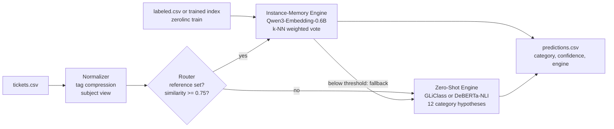
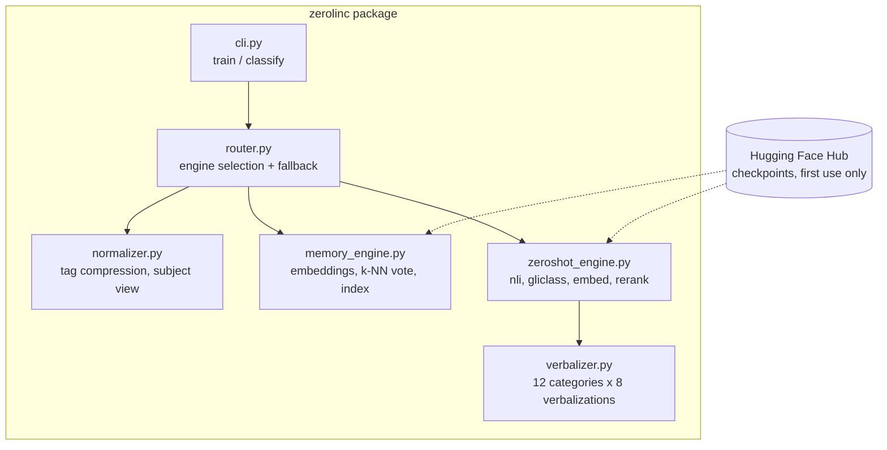
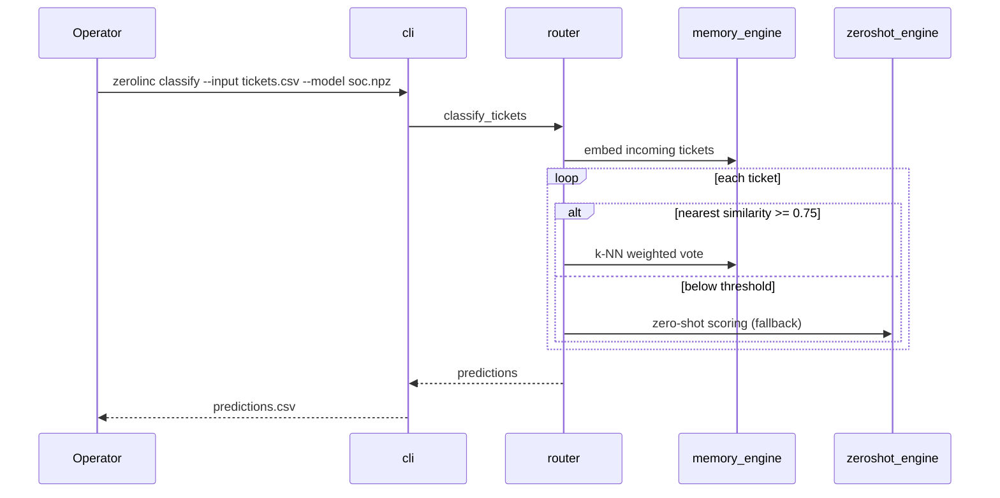

# ZeroLINC architecture

One module per component, matching the paper; one command in front.

## Data flow

```mermaid
flowchart LR
    IN["tickets.csv"] --> N["Normalizer<br/>tag compression<br/>subject view"]
    N --> R{"Router<br/>reference set?<br/>similarity >= 0.75?"}
    REF["labeled.csv or trained index<br/>zerolinc train"] --> M
    R -->|yes| M["Instance-Memory Engine<br/>Qwen3-Embedding-0.6B<br/>k-NN weighted vote"]
    R -->|no| Z["Zero-Shot Engine<br/>GLiClass or DeBERTa-NLI<br/>12 category hypotheses"]
    M -->|below threshold: fallback| Z
    M --> OUT["predictions.csv<br/>category, confidence, engine"]
    Z --> OUT
```

## Modules

```mermaid
flowchart TB
    subgraph pkg["zerolinc package"]
        CLI["cli.py<br/>train / classify"] --> RT["router.py<br/>engine selection + fallback"]
        RT --> NM["normalizer.py<br/>tag compression, subject view"]
        RT --> ME["memory_engine.py<br/>embeddings, k-NN vote, index"]
        RT --> ZE["zeroshot_engine.py<br/>nli, gliclass, embed, rerank"]
        ZE --> VB["verbalizer.py<br/>12 categories x 8 verbalizations"]
    end
    HF[("Hugging Face Hub<br/>checkpoints, first use only")] -.-> ME
    HF -.-> ZE
```

## Engine selection sequence

```mermaid
sequenceDiagram
    participant U as Operator
    participant C as cli
    participant R as router
    participant M as memory_engine
    participant Z as zeroshot_engine
    U->>C: zerolinc classify --input tickets.csv --model soc.npz
    C->>R: classify_tickets
    R->>M: embed incoming tickets
    loop each ticket
        alt nearest similarity >= 0.75
            R->>M: k-NN weighted vote
        else below threshold
            R->>Z: zero-shot scoring (fallback)
        end
    end
    R-->>C: predictions
    C-->>U: predictions.csv
```
