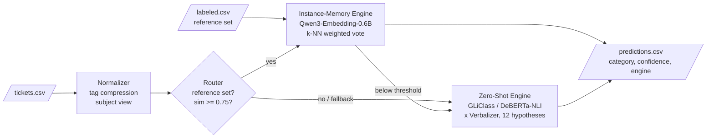
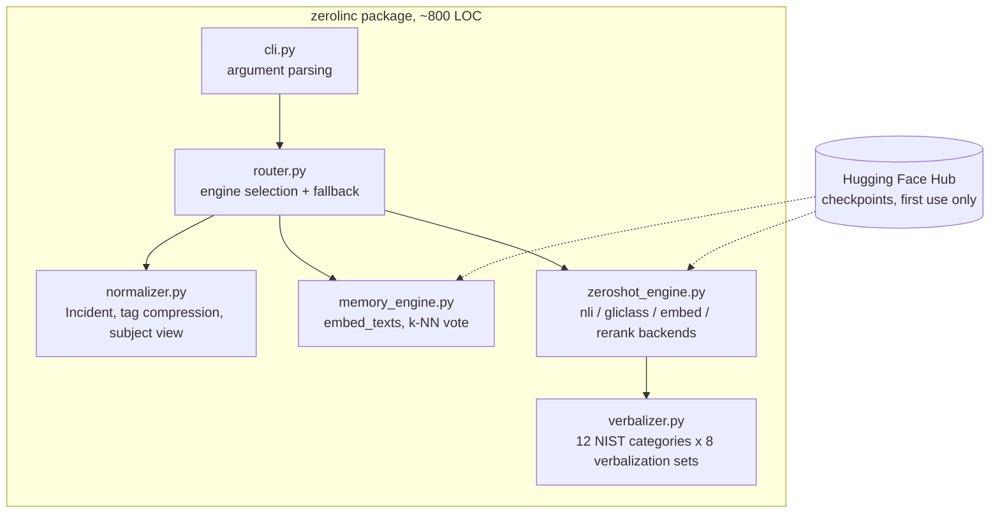
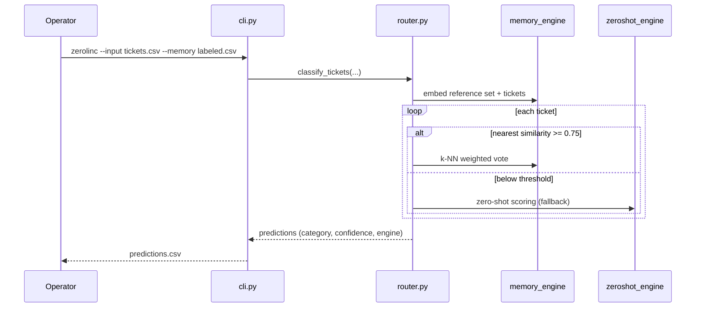

# ZeroLINC architecture

The package mirrors the architecture described in the paper: one module per
component, one command in front.

## Data flow

```mermaid
flowchart LR
    IN[/tickets.csv/] --> N[Normalizer\ntag compression\nsubject view]
    N --> R{Router\nreference set?\nsim >= 0.75?}
    REF[/labeled.csv\nreference set/] --> M
    R -->|yes| M[Instance-Memory Engine\nQwen3-Embedding-0.6B\nk-NN weighted vote]
    R -->|no / fallback| Z[Zero-Shot Engine\nGLiClass / DeBERTa-NLI\nx Verbalizer, 12 hypotheses]
    M -->|below threshold| Z
    M --> OUT[/predictions.csv\ncategory, confidence, engine/]
    Z --> OUT
```

## Modules

```mermaid
flowchart TB
    subgraph zerolinc [zerolinc package, ~800 LOC]
        CLI[cli.py\nargument parsing] --> RT[router.py\nengine selection + fallback]
        RT --> NM[normalizer.py\nIncident, tag compression, subject view]
        RT --> ME[memory_engine.py\nembed_texts, k-NN vote]
        RT --> ZE[zeroshot_engine.py\nnli / gliclass / embed / rerank backends]
        ZE --> VB[verbalizer.py\n12 NIST categories x 8 verbalization sets]
    end
    HF[(Hugging Face Hub\ncheckpoints, first use only)] -.-> ME
    HF -.-> ZE
```

## Engine selection sequence

```mermaid
sequenceDiagram
    participant U as Operator
    participant C as cli.py
    participant R as router.py
    participant M as memory_engine
    participant Z as zeroshot_engine
    U->>C: zerolinc --input tickets.csv --memory labeled.csv
    C->>R: classify_tickets(...)
    R->>M: embed reference set + tickets
    loop each ticket
        alt nearest similarity >= 0.75
            R->>M: k-NN weighted vote
        else below threshold
            R->>Z: zero-shot scoring (fallback)
        end
    end
    R-->>C: predictions (category, confidence, engine)
    C-->>U: predictions.csv
```
